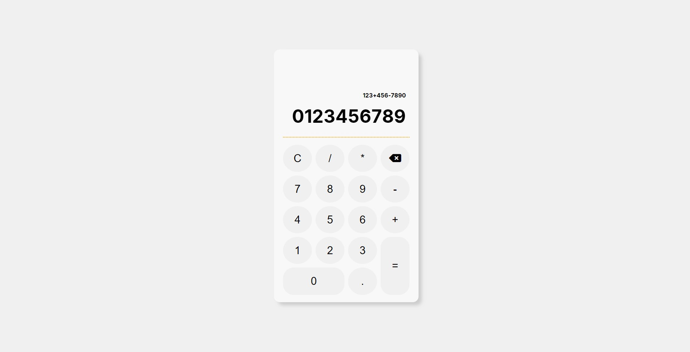

## The Odin Project Simple Calculator

## General Info

The goal is to design simple calculator app basis on course assignment with code as clear as possible for beginner. The calculator should do simple math like add, subtract, divide, etc.

## Features

- Basic math operations (add, subtract, multiply, divide) also possible to string several operations;
- Enable to reset calculations or delete a single input(backspace);
- Dual input functionality - keyboard/on-screen typing.

## Technologies

Built with:

- HTML,
- CSS (Sass),
- Vanilla Javascript.

## Inspiration & resources

The Odin Project project assumptions: https://www.theodinproject.com/lessons/foundations-calculator
Background pattern: https://www.magicpattern.design/

## Status

Completed.

# Conclusions & Issues

--
