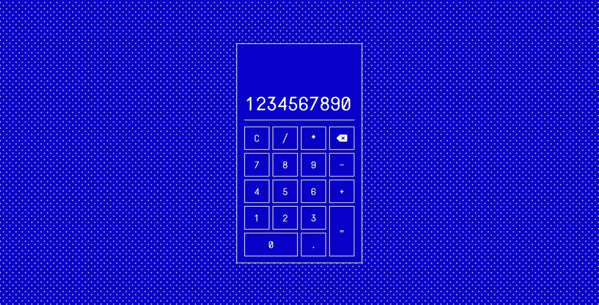

## Odin-Project-Calculator

## General Info
Simple calculator project which follows assumptions of The Odin Project course. The calculator should do simple math like add, subtract, divide, etc. 

## Features
* Basic math operations (add, subtract, multiply, divide) also possible to string several operations;
* Enable to reset calculations or delete a single input(backspace); 
* Dual input functionality - keyboard/on-screen typing.

## Technologies
Built with: 
* HTML, 
* CSS (Sass), 
* Vanilla Javascript. 
 
## Inspirations & resources
The Odin Project project assignemnt: https://www.theodinproject.com/lessons/foundations-calculator

## Status
Completed / Considering design changes

# Conclusions & Issues
--
